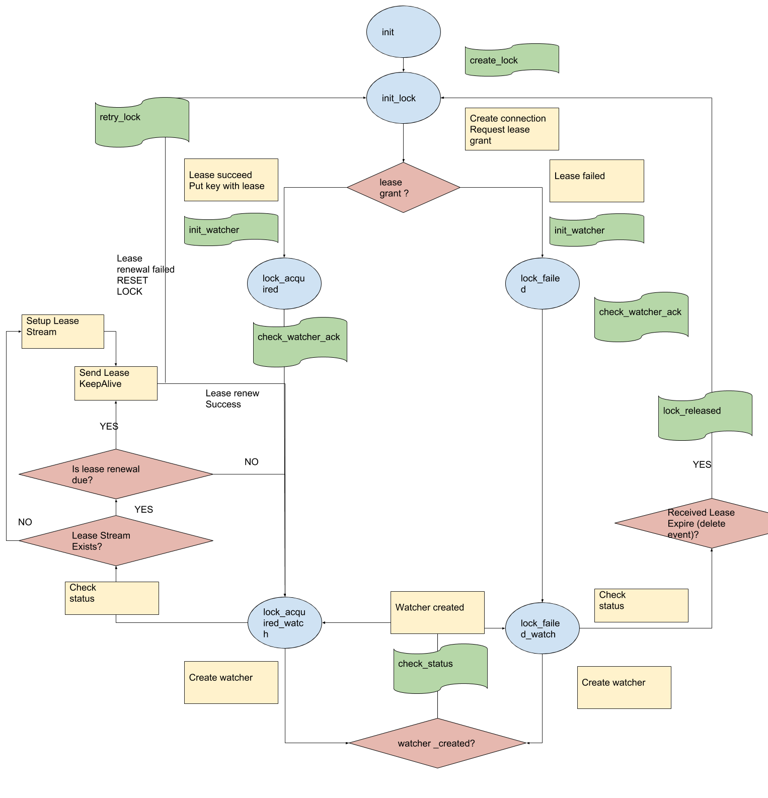

# etcd_dcs

This application provides distributed co-ordination service using etcd.

As pre-requisite requires to install etcd and run the grpc-proxy as mentioned below

##    How to install single node etcd ?

To install etcd (we will use version 3.3.10), run the script (present in the same directory as this README) as follows
* `./install_etcd.sh <FULL_PATH_WHERE_ETCD_SHOULD_BE_INSTALLED>`
* Example `./install_etcd.sh /tmp`

The installation script prints etcd version and etcdctl version at the end  
etcd Version: 3.3.10
Git SHA: 27fc7e2
Go Version: go1.10.4
Go OS/Arch: linux/amd64
etcdctl version: 3.3.10
API version: 3.3

Let us start etcd first
* `/tmp/etcd --listen-client-urls="http://0.0.0.0:2379" --advertise-client-urls="http://0.0.0.0:2379" &`

then

Starting grpc-proxy on port 23790, locally for namespacing **(used in `lock_mgr_SUITE` in RTS)**

* `/tmp/etcd grpc-proxy start --endpoints=localhost:2379 --listen-addr=127.0.0.1:23790 --advertise-client-url=127.0.0.1:23790 --namespace=trial_namespace/`

Sample checks for working can be done

* `ETCDCTL_API=3 /tmp/etcdctl  --endpoints=127.0.0.1:23790 put abc 2`
will return
OK
* `ETCDCTL_API=3 /tmp/etcdctl  --endpoints=127.0.0.1:23790 get abc`
will return
abc
2

## Simulating failover scenarios locally on console

### Starting etcd_dcs application on by two services/subscribers
* Run `rebar3 compile`; `rebar3 shell` and open two terminals, run the below remsh commands on each one of them
* ` erl -sname system1 -setcookie 'cookie' -remsh cookie@machine` for one lock subscriber 'system1' terminal
* ` erl -sname system2 -setcookie 'cookie' -remsh cookie@machine` for one lock subscriber 'system2' terminal
* Check if application is running in each remsh : `rp(lists:sort(proplists:get_keys(application:which_applications()))).` should result in presence of `etcd_dcs`
* If not present, run this command `application:start(etcd_dcs)`

### Apply for lock and check status, notification messages
* debug_pid parameter in the lock parameters passed into apply_for_lock sets the notification messages reception
* `lock_mgr:apply_for_lock(#{name => asset_nick1, from => self(), lease_duration_s => 10, lease_renewal_s => 5, host => "localhost", port => 23790, debug_pid => self()}).`
* `lock_mgr:debug_has_lock({asset_nick1, self()}).` if it returns true then has lock
* `flush().` to see notification messages

#### Set tracing
* {_LockRequest, LockSrvPid} = maps:get({asset_nick1, self()},maps:get(lock_registry,lock_mgr:cl(debug_state))).
* gen_server:call(LockSrvPid, {set_trace, [lock_status]}).

## Lock_srv finite state machine

